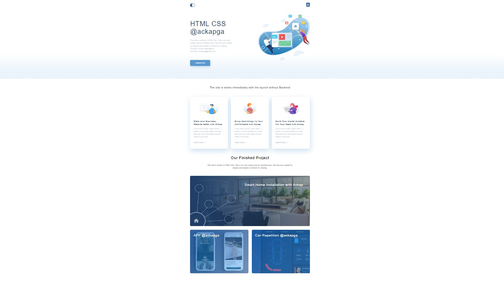
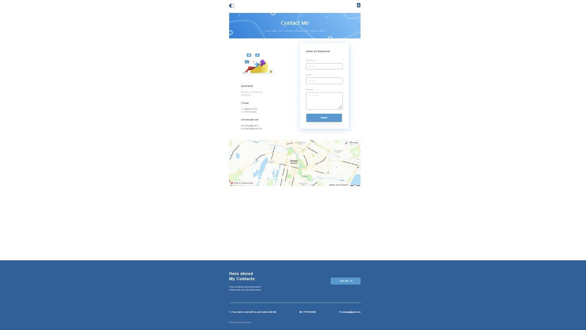

                                   

                                      My mini project, worked on HTML CSS

                                               ackapga@gmail.com

01. Добавил структуру html документа. Создать заголовок с произвольным текстом.
02. Доработал сайт. Добавил меню. Создал страницу «Контакты», добавил изображения, форму и карту. Доработал «Footer».
03. Добавил CSS, работаю на SCSS. Создать файл стилей и подключить к каждой странице. Работал через предпроцессор SCSS.
04. Разбил сайт по блокам. Добавил блоки. Сделал Header l Content l Footer.
05. Сделал Позиционирования. Выровнял сайт, доработал Яндекс Карту. Добавил Flexbox.
06. Добавил дизайн.
07. Прижал подвал сайта к нижней части экрана. Добавил родительский контейнер всему коду, и разделил сайт на"wrapper__top" и "footer".
08. Сделал адаптивную верстку Главной страницы. Добавил Адаптивность главной страницы для планшетов и сотовых телефонов.
09. Сделал адаптивную верстку Контакты и остальных страниц Сайта.

### <a href="https://www.figma.com/file/AOKabCJEdEqr9ZZEaJ0IMS/html%2Fcss-(Copy)?t=AM0v53OXGKnEURMJ-0">Ссылка на Figma</a> 